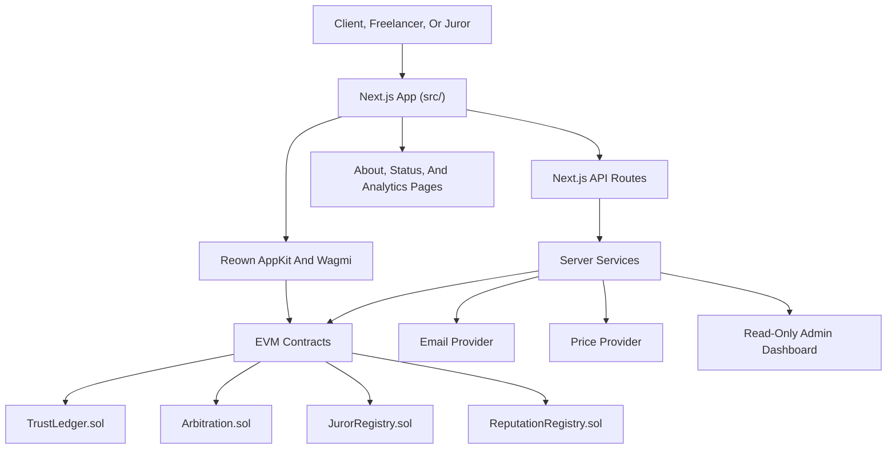

<p align="center">
  
</p>

# TrustLedger

**Authors & Contributors:** [Kevin Le](https://www.linkedin.com/in/lekevin1),
[Kellen Snider](https://www.linkedin.com/in/kellen-snider-683396256/)

TrustLedger is a decentralized escrow, arbitration, and reputation system for
freelance agreements on EVM chains. It helps a client lock funds, a freelancer
submit work, and both parties resolve approval, warranty, rating, and dispute
outcomes through audited code paths instead of platform custody.

**Repository description:** Decentralized freelance escrow with encrypted
contract drafting, optional live co-editing, EVM smart-contract custody, juror
arbitration, reputation, notifications, and production-grade Next.js tooling.

**Links:** [Website](https://trustledger-zeta.vercel.app/en) ·
[Docs](https://kevinle3212.github.io/TrustLedger) ·
[Source](https://github.com/kevinle3212/TrustLedger)

> Status: testnet-focused software. Contracts are unaudited and should not be
> used for production custody until an independent audit and mainnet readiness
> review are complete.

[](https://github.com/kevinle3212/TrustLedger/actions/workflows/ci.yml)
[](https://github.com/kevinle3212/TrustLedger/actions/workflows/security.yml)
[](https://github.com/kevinle3212/TrustLedger/actions/workflows/docs.yml)
[](LICENSE)

## Table Of Contents

- [Project Overview](#project-overview)
- [Feature Breakdown](#feature-breakdown)
- [Architecture](#architecture)
- [Technology Stack](#technology-stack)
- [Repository Structure](#repository-structure)
- [Development Setup](#development-setup)
- [Environment Configuration](#environment-configuration)
- [Authentication Architecture](#authentication-architecture)
- [Database Architecture](#database-architecture)
- [API Architecture](#api-architecture)
- [Smart Contract Architecture](#smart-contract-architecture)
- [Oracle Architecture](#oracle-architecture)
- [Deployment](#deployment)
- [Security](#security)
- [Legal And Compliance](#legal-and-compliance)
- [Testing Strategy](#testing-strategy)
- [CI/CD](#cicd)
- [Documentation](#documentation)
- [Troubleshooting](#troubleshooting)
- [FAQ](#faq)
- [Contributing](#contributing)
- [Roadmap](#roadmap)
- [Credits](#credits)

## Project Overview

TrustLedger keeps custody-critical state on-chain while using the frontend and
server routes for workflow clarity, notifications, display data, and developer
ergonomics. The product is designed for mainstream freelancers and clients who
may be new to Web3, so the interface emphasizes plain-language states,
accessible controls, and visible transaction progress.

## Feature Breakdown

| Area           | Capabilities                                                                                                                                                                                                                             |
| -------------- | ---------------------------------------------------------------------------------------------------------------------------------------------------------------------------------------------------------------------------------------- |
| Escrow         | Freelancer-proposed and client-proposed contracts, ETH or ERC-20 funding, project deadlines, acceptance windows, warranty holds, cancellation, reclaim, and payout.                                                                      |
| Arbitration    | Staked juror registry, random juror selection, commit-reveal voting, median ruling, appeals, rewards, and slashing.                                                                                                                      |
| Reputation     | Bidirectional ratings, recovery tracking, and frontend reputation history.                                                                                                                                                               |
| Frontend       | Localized Next.js App Router UI, wallet connection, role switching, encrypted contract drafting with optional live rooms, contract creation, dashboard actions, juror views, FAQ, dark mode, high-contrast mode, and responsive layouts. |
| Backend Routes | Contract aggregation, health checks, magic links, notifications, deadline cron, oracle rates, and oracle status metadata.                                                                                                                |
| Storage        | IPFS links, optional Arweave support, client-side AES-GCM document encryption helpers.                                                                                                                                                   |
| Tooling        | Hardhat, Foundry, Jest, Playwright, React Doctor, mypy, Solhint, markdownlint, Prettier, Docker, Kubernetes, MkDocs, and GitHub Actions.                                                                                                 |

## Architecture



## Technology Stack

| Layer            | Tools                                                                     |
| ---------------- | ------------------------------------------------------------------------- |
| Frontend         | Next.js 16, React 19, TypeScript, next-intl, Tailwind CSS v4, Sass        |
| Wallet and chain | Reown AppKit, wagmi, viem, Ethereum Sepolia, Arbitrum One, Base, Optimism |
| Backend          | Next.js route handlers, Resend, server-side viem clients                  |
| Contracts        | Solidity 0.8.24, OpenZeppelin, Hardhat, Foundry                           |
| Python           | ReportLab utility generator, GitHub Models scripts, strict mypy           |
| Docs             | MkDocs Material, markdownlint                                             |
| CI/CD            | GitHub Actions, Vercel, Dependabot                                        |

## Repository Structure

```text
.
├── contracts/
│   ├── src/                Solidity escrow, arbitration, juror, reputation contracts
│   ├── script/             Foundry deployment and wiring scripts
│   ├── test/               Foundry unit, invariant, and fork tests
│   ├── foundry-sandbox/    Isolated Foundry repro and experiment workspace
│   └── foundry.toml        Foundry profiles, compiler, formatter, RPC config
├── src/
│   ├── app/                Next.js App Router pages, API routes, global styles
│   ├── components/         Shared UI, wallet, accessibility, and form controls
│   ├── contexts/           Role and cross-cutting React context
│   ├── hooks/              Client hooks for contract/dispute helpers
│   ├── lib/                ABI, chain config, validation, storage, crypto helpers
│   ├── services/           Server health, email, notification, oracle, admin logic
│   ├── store/              Client persistence for arbitration drafts
│   ├── tests/              Jest unit tests, mocks, Playwright E2E specs
│   ├── types/              Shared frontend TypeScript domain models
│   ├── public/             Static images, icons, manifest, and public assets
│   └── README.md           Frontend/API architecture map
├── k8s/                    Kustomize base, probes, secrets template, HPA, ingress
├── docker/                 Frontend runtime Dockerfile and local service images
├── lib/                    Rust shared backend crates
├── programs/               Rust backend service binaries
├── infra/                  Backend service infrastructure examples
├── docs/                   MkDocs guides, deployment, security, reports, runbooks
├── scripts/                Hardhat deploy/demo scripts and GitHub Models tooling
├── test/                   Hardhat TypeScript contract tests
├── tools/                  Setup, SWC, logs, docs links, Kubernetes helper scripts
├── utils/                  Python contract-template PDF utility
├── stubs/                  Hand-written Python type stubs
├── assets/                 Canonical project assets and placeholders
├── .github/                CI, security, docs, prompts, Dependabot, Copilot config
├── .cursor/                Cursor rules by frontend/backend/contracts/security area
├── .sixth/                 Sixth agent README and reusable skills
├── .codex/                 Codex-specific AGENTS guidance
├── .claude/                Claude settings and commands
├── .coderabbit.yaml        Strict CodeRabbit review policy
└── .mcp.json               Serena and Nexus MCP server config
```

<details>
<summary>Frontend source map</summary>

`src/` is the deployed Next.js application and has its own deeper map in
[src/README.md](src/README.md).

```text
src/
├── app/
│   ├── [locale]/                  Locale-prefixed user routes.
│   │   ├── _components/           Route-shared localized UI modules.
│   │   ├── arbitration/[id]/      Dispute detail and evidence workflow.
│   │   ├── client/accept/         Client magic-link acceptance flow.
│   │   ├── create/                Contract creation state machine and form UI.
│   │   ├── about/                 Project background and project-age timer.
│   │   ├── dashboard/             Contract dashboard, countdowns, and lifecycle actions.
│   │   ├── faq/                   Recovery, wallet, faucet, and support FAQ.
│   │   ├── freelancer/review/     Freelancer review for client-originated work.
│   │   ├── juror/                 Juror staking, voting, and dispute queue.
│   │   ├── legal/                 Legal, policy, and compliance publication index.
│   │   └── reputation/            Reputation lookup and history UI.
│   ├── api/
│   │   ├── admin/                 Restricted operator dashboard APIs.
│   │   ├── contract/[id]/         JSON-safe on-chain contract aggregation.
│   │   ├── cron/                  Vercel Cron endpoints.
│   │   ├── health/                Runtime and admin health probes.
│   │   ├── magic-link/            HMAC review and acceptance token routes.
│   │   ├── notifications/         Bearer-gated lifecycle email sender.
│   │   └── oracle/                Display exchange-rate and freshness endpoints.
│   ├── app-desktop.scss           Desktop shell and workspace layout rules.
│   ├── globals.scss               Tailwind v4, tokens, keyframes, global motion.
│   └── helpers.css                Reusable utility classes outside Tailwind tokens.
├── components/                    Navigation, wallet, forms, fields, toggles, footer.
├── contexts/                      Role and cross-cutting React context providers.
├── helpers/                       Typed frontend helpers for legal docs and Solana.
├── hooks/                         Client hooks for dispute and contract helpers.
├── helpers/                       Legal localization and Solana support helpers.
├── i18n/                          next-intl routing, request config, navigation wrappers.
├── lib/                           ABI, chain config, validation, encryption, storage helpers.
├── messages/                      Locale JSON dictionaries.
├── providers/                     External provider adapters and chain-facing constants.
├── services/                      Server-only health, email, notification, oracle, admin logic.
├── store/                         Client persistence for arbitration drafts.
├── tests/                         Jest unit tests and Playwright route/a11y checks.
├── types/                         Frontend domain model exports.
├── utils/                         Small pure utility modules.
├── public/                        Static icons, manifest, and public assets.
└── vercel.json                    Frontend deployment and cron configuration.
```

</details>

<details>
<summary>Smart contract and chain tooling map</summary>

```text
contracts/
├── src/
│   ├── TrustLedger.sol            Escrow lifecycle, approvals, payout, warranty logic.
│   ├── Arbitration.sol            Commit-reveal arbitration and appeal lifecycle.
│   ├── JurorRegistry.sol          Juror staking, assignment, slashing, and rewards.
│   ├── ReputationRegistry.sol     Bidirectional rating and recovery history.
│   └── mocks/                     Test-only token and integration helpers.
├── script/                        Foundry scripts for deploy and registry wiring.
├── test/                          Solidity unit, invariant, fork, and fuzz tests.
├── foundry-sandbox/               Isolated scratch project for minimal repros.
├── foundry.toml                   Compiler, optimizer, fuzz, invariant, RPC profiles.
└── lib/
    ├── openzeppelin-contracts/    Pinned upstream submodule.
    └── forge-std/                 Vendored Foundry standard library.
```

Root-level Hardhat tests remain under `test/` for TypeScript integration checks,
while Foundry is the primary Solidity unit/fuzz harness.

</details>

<details>
<summary>Documentation, automation, and agent map</summary>

```text
docs/
├── reports/                       Audit, dependency, coverage, and operational reports.
├── DEPLOYMENT.md                  Vercel, canonical URL, release, and env runbook.
├── DOCKER.md                      Container build and runtime guide.
├── ENVIRONMENT.md                 Required env vars and secret ownership.
├── FRONTEND.md                    Next.js architecture and UI conventions.
├── KUBERNETES.md                  Kustomize, secrets, probes, ingress, HPA.
├── LEGAL.md                       Legal inventory and review workflow.
├── SECURITY.md                    Security model, disclosure, gates, and findings.
├── SMART-CONTRACTS.md             Contract architecture, submodules, test profiles.
├── SOLANA.md                      Native Solana support decision and next milestones.
└── TESTING.md                     Unit, E2E, contract, docs, and quality commands.

.github/
├── workflows/                     CI, security, docs, React Doctor, log hygiene.
├── dependabot.yml                 Dependency update policy.
├── copilot-instructions.md        Copilot repository guidance.
└── prompts/                       Reusable review and automation prompts.

.codex/                            Codex-specific guidance.
.claude/                           Claude commands and settings.
.cursor/                           Cursor rules and project context.
.sixth/                            Sixth README and agent skills.
src/.agents/, src/.claude/, src/skills/
                                    Frontend-scoped agent skills mirrored by harness.
```

</details>

<details>
<summary>Generated, cache, and local-only folders</summary>

These folders may appear during local work and should not be edited by hand:
`src/.next/`, `.vercel/output/`, `artifacts/`, `hardhat-cache/`,
`contracts/out/`, `contracts/cache/`, `src/coverage/`, `site/`, `.swc/`,
`src/.swc/`, `.mypy_cache/`, and `__pycache__/`.

Read [SWC And Generated Build Artifacts](docs/SWC.md).

</details>

<details>
<summary>Legal and security document map</summary>

Root legal documents are formatted and linted as Markdown, referenced by the
frontend legal center, and excluded from build/deploy paths when the build does
not need their bodies. Keep legal/compliance edits synchronized with
[docs/LEGAL.md](docs/LEGAL.md), [SECURITY.md](SECURITY.md), and
[docs/SECURITY.md](docs/SECURITY.md).

```text
ACCEPTABLE_USE_POLICY.md           Acceptable use and prohibited conduct.
COMMUNITY_GUIDELINES.md           Community, evidence, and juror conduct.
CONTENT_POLICY.md                  User content, evidence, and deliverable rules.
COOKIE_POLICY.md                   Cookies, local storage, and consent expectations.
DISCLAIMER.md                      No-advice and warranty disclaimers.
DMCA_POLICY.md                     Copyright takedown and counter-notice process.
PRIVACY_POLICY.md                  Personal data, wallet identifiers, and rights.
RISK_DISCLOSURE.md                 Blockchain, wallet, smart contract, and market risk.
TERMS_AND_CONDITIONS.md            User terms and platform conditions.
TRADEMARK_POLICY.md                Brand use and impersonation policy.
SECURITY.md                        Vulnerability disclosure and supported scope.
```

</details>

## Development Setup

### Requirements

| Tool             | Version                                        |
| ---------------- | ---------------------------------------------- |
| Node.js          | `>=22.0.0`                                     |
| npm for frontend | `11.12.1`                                      |
| Python           | `.python-version`                              |
| Foundry          | CI currently pins `v1.5.1` for Solidity checks |

### Install

```bash
bash tools/setup.sh
```

Or install packages manually:

```bash
npm install
cd src
npm install
```

### Common Commands

| Task                      | Command                          |
| ------------------------- | -------------------------------- |
| Compile Hardhat contracts | `npm run compile`                |
| Run Hardhat tests         | `npm run hardhat:test`           |
| Run Foundry tests         | `npm run foundry:test`           |
| Run all typechecks        | `npm run typecheck`              |
| Run root lint             | `npm run lint`                   |
| Run Python mypy           | `npm run lint:py`                |
| Build docs strictly       | `npm run docs:build`             |
| Check local docs links    | `npm run docs:links`             |
| Check external docs links | `npm run docs:links:external`    |
| Start frontend            | `cd src && npm run dev:frontend` |
| Build frontend            | `npm run build:frontend`         |
| Run frontend unit tests   | `npm run test:frontend:unit`     |
| Run React Doctor          | `cd src && npm run doctor`       |

## Environment Configuration

Copy examples before local development:

```bash
cp .env.example .env
cp src/.env.local.example src/.env.local
```

Important groups:

| Group           | Examples                                                                                |
| --------------- | --------------------------------------------------------------------------------------- |
| RPC and deploy  | `SEPOLIA_RPC_URL`, `DEPLOYER_PRIVATE_KEY`, `ETHERSCAN_API_KEY`                          |
| Frontend public | `NEXT_PUBLIC_WALLETCONNECT_PROJECT_ID`, `NEXT_PUBLIC_APP_URL`, `NEXT_PUBLIC_PINATA_JWT` |
| Notifications   | `MAGIC_LINK_SECRET`, `RESEND_API_KEY`, `NOTIFICATIONS_SECRET`, `CRON_SECRET`            |
| Oracle          | `ORACLE_PRICE_SOURCE_URL`, `ORACLE_RATE_TTL_MS`                                         |
| Vercel          | `VERCEL_TOKEN`, `VERCEL_ORG_ID`, `VERCEL_PROJECT_ID`                                    |

Read [Environment](docs/ENVIRONMENT.md).

## Authentication Architecture

Wallet connection establishes the active address for client-side contract
actions. Magic links support email-assisted acceptance and review flows. The
current implementation is not a full account database. Future off-chain accounts
should use wallet sign-in, short-lived JWTs, and route authorization bound to
the authenticated wallet.

Privileged routes:

- `GET /api/health` requires `Authorization: Bearer <HEALTH_CHECK_TOKEN>` or an
  IP listed in `HEALTH_CHECK_ALLOWED_IPS`. `GET /api/health/runtime` remains
  public for Kubernetes and uptime runtime probes.
- `POST /api/notifications` requires
  `Authorization: Bearer <NOTIFICATIONS_SECRET>`.
- `GET /api/cron/deadline-reminders` requires
  `Authorization: Bearer <CRON_SECRET>`.

## Database Architecture

There is no production database in this repository today. Durable custody and
lifecycle state live in smart contracts. Off-chain data is limited to:

- Environment-backed address-to-email maps for deadline reminders.
- Client-side localStorage for role, theme, contrast, and wallet hints.
- External storage references such as IPFS and Arweave URIs.

Any future database must document data ownership, retention, PII handling,
wallet authorization, and migration strategy before adoption.

## API Architecture

| Route                              | Purpose                                          | Auth               |
| ---------------------------------- | ------------------------------------------------ | ------------------ |
| `GET /api/health/runtime`          | Runtime probe for containers and smoke checks.   | Public             |
| `GET /api/health`                  | Operational config health.                       | Bearer/IP admin    |
| `GET /api/contract/[id]`           | JSON-safe on-chain contract aggregation.         | Public             |
| `POST /api/magic-link/send`        | Send review/acceptance magic link.               | Server env secrets |
| `GET /api/magic-link/verify`       | Verify HMAC magic-link token.                    | Token              |
| `POST /api/notifications`          | Send lifecycle email.                            | Bearer secret      |
| `GET /api/cron/deadline-reminders` | Scan deadlines and send reminders.               | Bearer secret      |
| `GET /api/oracle/rates`            | Fetch supported display exchange rate.           | Public             |
| `GET /api/oracle/status`           | Report oracle provider, TTL, pairs, cache state. | Public             |

## Smart Contract Architecture

| Contract                 | Responsibility                                                                                                     |
| ------------------------ | ------------------------------------------------------------------------------------------------------------------ |
| `TrustLedger.sol`        | Escrow lifecycle, funding, proof submission, approval, disputes, warranty funds, ratings, allowed tokens, pausing. |
| `Arbitration.sol`        | Dispute lifecycle, juror selection, commit-reveal votes, appeals, rewards, slashing.                               |
| `JurorRegistry.sol`      | Juror staking, eligibility, locks, cooldowns, active dispute accounting.                                           |
| `ReputationRegistry.sol` | Rating aggregation, penalties, recovery mode, average score reads.                                                 |

Read [Smart Contracts](docs/SMART-CONTRACTS.md) and
[Arbitration](docs/ARBITRATION.md).

## Oracle Architecture

Oracle rates are display/support data only. `src/services/oracle.ts` validates
an allowlist, fetches a CoinGecko-compatible payload, caches results briefly,
and marks stale cache fallback responses. Read
[Oracle Architecture](docs/ORACLE.md).

## Deployment

The frontend targets Vercel. Contracts can be deployed locally or to configured
networks through Hardhat and Foundry. The manual Sepolia deploy workflow writes
contract addresses into Vercel before triggering a frontend redeploy. Use
`https://trustledger-zeta.vercel.app/en` as the canonical production frontend
URL.

Read [Deployment](docs/DEPLOYMENT.md) and [CI/CD](docs/CI-CD.md).

## Security

TrustLedger treats private keys, bearer secrets, RPC credentials, email tokens,
and deployment credentials as sensitive. Server routes validate request
boundaries and avoid returning secret values. Smart contract changes must
prioritize access control, reentrancy resistance, event coverage, gas awareness,
and audit-ready clarity.

Read [Security](SECURITY.md) and [Security Docs](docs/SECURITY.md).

## Legal And Compliance

Legal and compliance-sensitive changes are tracked through
[Legal And Compliance](docs/LEGAL.md), the root legal draft inventory, and the
website legal center at `/en/legal`. Root legal drafts remain owner-controlled
until explicitly approved for editing and publication.

## Testing Strategy

| Layer             | Tests                                                                |
| ----------------- | -------------------------------------------------------------------- |
| Contracts         | Hardhat TypeScript tests, Foundry unit tests, fuzz tests, fork tests |
| Frontend services | Jest unit tests                                                      |
| Components        | React Testing Library                                                |
| Browser routes    | Playwright desktop and mobile projects                               |
| Python            | Strict mypy                                                          |
| Static analysis   | ESLint, Solhint, Forge lint, markdownlint, Prettier, React Doctor    |

Phase 7 Item 3 is tracked as completed for the current testing sweep with new
legal, Solana, and interactive component coverage. Remaining future coverage
gaps stay documented in the
[Coverage Gap Report](docs/reports/coverage-gap-report.md).

## CI/CD

GitHub Actions cover:

- Frontend typecheck, lint, build, and Playwright.
- Root TypeScript lint and typecheck.
- Python mypy.
- Hardhat compile and tests.
- Foundry build, format check, and tests.
- Security scans: Slither, TruffleHog, npm audit, CodeQL, Semgrep.
- Docs build and GitHub Pages publish.
- Dependabot grouping and selected automerge.

## Documentation

- [Frontend README](src/README.md)
- [Architecture](docs/ARCHITECTURE.md)
- [Frontend](docs/FRONTEND.md)
- [Analytics And Native Kernels](docs/ANALYTICS.md)
- [Oracle](docs/ORACLE.md)
- [Utilities](docs/UTILITIES.md)
- [Type Stubs](docs/STUBS.md)
- [SWC And Artifacts](docs/SWC.md)
- [Testing](docs/TESTING.md)
- [Environment](docs/ENVIRONMENT.md)
- [Contributing](docs/CONTRIBUTING.md)

## Troubleshooting

| Problem                               | Check                                                                                |
| ------------------------------------- | ------------------------------------------------------------------------------------ |
| WalletConnect QR/mobile pairing fails | Set `NEXT_PUBLIC_WALLETCONNECT_PROJECT_ID`.                                          |
| Contract API reads fail               | Set `SEPOLIA_RPC_URL` and deployed contract addresses.                               |
| Magic links fail                      | Set `MAGIC_LINK_SECRET`, `RESEND_API_KEY`, `RESEND_FROM`, and `NEXT_PUBLIC_APP_URL`. |
| Deadline cron sends no email          | Set `CRON_SECRET` and `NOTIFICATION_EMAILS`.                                         |
| Oracle route returns `502`            | Check provider availability and `ORACLE_PRICE_SOURCE_URL`.                           |
| Frontend build cannot find contracts  | Run `npm run sync:frontend:env` after local deploy.                                  |

## FAQ

<details>
<summary>Is TrustLedger production ready?</summary>

No. The project is testnet-focused until contract audit, deployment review,
monitoring, and production incident workflows are complete.

</details>

<details>
<summary>Does the backend control escrow funds?</summary>

No. Escrow custody and lifecycle transitions are enforced by smart contracts.
Backend routes provide aggregation, email, cron, and display data.

</details>

<details>
<summary>Does TrustLedger use a database?</summary>

Not yet. Durable protocol state is on-chain. A future off-chain account database
would require a separate design and security review.

</details>

<details>
<summary>Can oracle prices decide payouts?</summary>

No. Current oracle routes are informational only.

</details>

## Contributing

1. Create a branch.
2. Keep changes scoped.
3. Update docs for behavior, env, scripts, route, contract, or tooling changes.
4. Run the relevant quality gates.
5. Open a pull request and wait for CI.

Do not commit secrets, generated build output, local caches, or unrelated
formatting churn.

## Roadmap

The active roadmap lives in [TODO.md](TODO.md). Do not mark roadmap, Oracle,
phase, milestone, or planning items complete without objective implementation
and validation evidence.

## Credits

TrustLedger was created by Kevin Le with contributions from Kellen Snider and
the early university demo context that shaped the project.

## License

Apache License 2.0. See [LICENSE](LICENSE) when present or the package metadata
for licensing details.
