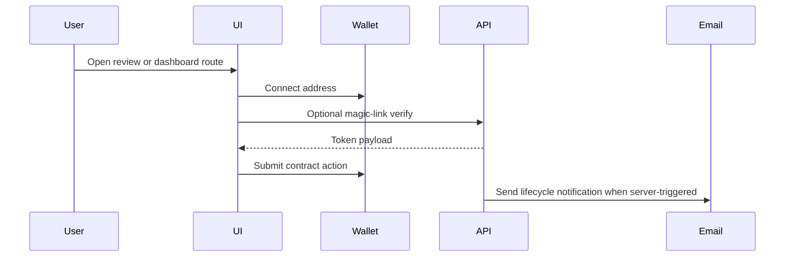
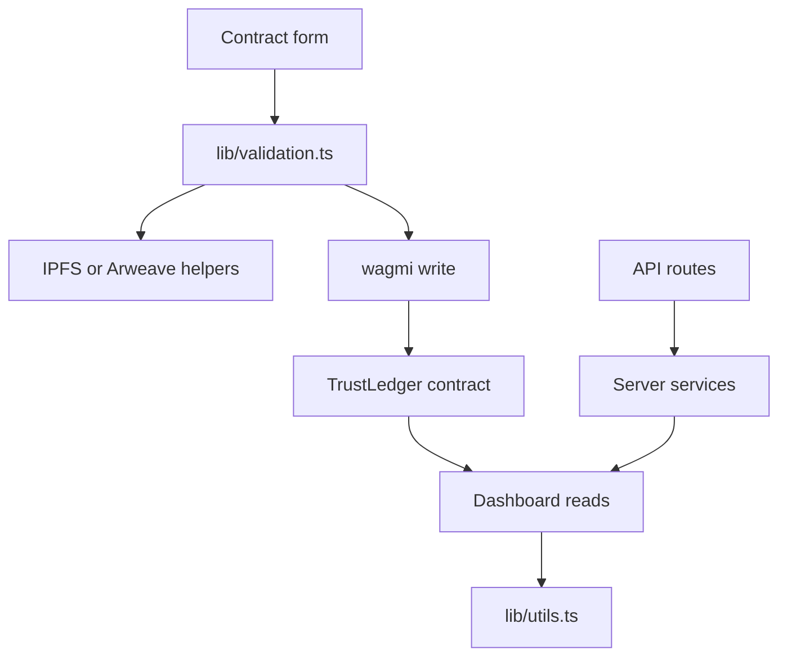

# TrustLedger Frontend And API

`src/` is the TrustLedger Next.js application. It contains the localized browser
UI, wallet wiring, API routes, server-side services, tests, public assets, and
frontend-specific developer tooling.

## Table Of Contents

- [Architecture](#architecture)
- [Directory Structure](#directory-structure)
- [Routing](#routing)
- [Frontend Architecture](#frontend-architecture)
- [Backend API Architecture](#backend-api-architecture)
- [State Management](#state-management)
- [Styling Architecture](#styling-architecture)
- [Authentication Flow](#authentication-flow)
- [Data Flow](#data-flow)
- [Performance](#performance)
- [Accessibility](#accessibility)
- [Testing](#testing)
- [Developer Workflow](#developer-workflow)

## Architecture

```mermaid
flowchart LR
    Layout[app/[locale]/layout.tsx] --> Providers[Providers]
    Providers --> Theme[next-themes]
    Providers --> Wagmi[wagmi and Reown AppKit]
    Providers --> Query[React Query]
    Layout --> Navbar[Navbar]
    Layout --> Pages[Localized route pages]
    Pages --> Components[Route and shared components]
    Pages --> Lib[lib helpers]
    Pages --> API[app/api routes]
    API --> Services[services]
    Services --> Chain[viem public clients]
    Services --> Email[Resend]
    Services --> Oracle[Price provider]
```

## Directory Structure

```text
src/
├── app/                    App Router pages, layouts, API routes, SCSS
├── components/             Shared UI and wallet controls
├── contexts/               Cross-cutting React context
├── i18n/                   next-intl routing and navigation helpers
├── lib/                    Chain, validation, storage, encryption, utility helpers
├── messages/               Localized copy
├── services/               Server-side health, email, notifications, oracle logic
├── tests/                  Jest unit tests and Playwright specs
├── public/                 Static assets
├── .agents/                Frontend agent specialist guidance
├── .claude/                Frontend Claude skills
└── skills/                 Reusable frontend development skills
```

## Routing

All user-facing routes are locale-prefixed through `next-intl`.

| Route                         | Purpose                                     |
| ----------------------------- | ------------------------------------------- |
| `/[locale]`                   | Landing and workflow overview.              |
| `/[locale]/create`            | Contract creation and document upload flow. |
| `/[locale]/dashboard`         | Contract cards and lifecycle actions.       |
| `/[locale]/client/accept`     | Client magic-link review and acceptance.    |
| `/[locale]/freelancer/review` | Freelancer review for client-proposed work. |
| `/[locale]/arbitration/[id]`  | Dispute evidence and arbitration detail.    |
| `/[locale]/juror`             | Juror staking and voting workflows.         |
| `/[locale]/reputation`        | Reputation lookup and history.              |
| `/[locale]/faq`               | Recovery and support content.               |

## Frontend Architecture

- `Providers.tsx` wraps theme, role, wagmi, React Query, AppKit theme sync, and
  inactivity logout.
- `Navbar.tsx` owns top-level navigation, role switching, source link, contrast
  toggle, theme toggle, and wallet control.
- Route-specific components live beside their route, for example
  `app/[locale]/create/_components`.
- Shared primitives such as `Field`, `Input`, `Select`, and `ConnectButton` live
  in `components/`.
- Chain data, ABI constants, address resolution, and network helpers live in
  `lib/`.

## Backend API Architecture

| Route                         | Service                                 | Notes                                           |
| ----------------------------- | --------------------------------------- | ----------------------------------------------- |
| `api/health`                  | `services/health.ts`                    | Reports config presence and URL validity.       |
| `api/contract/[id]`           | viem read in route                      | Returns JSON-safe contract aggregation.         |
| `api/magic-link/send`         | `lib/magicLink.ts`, `services/email.ts` | Sends wallet-bound HMAC link.                   |
| `api/magic-link/verify`       | `lib/magicLink.ts`                      | Verifies token signature and expiry.            |
| `api/notifications`           | `services/notifications.ts`             | Bearer-gated lifecycle email route.             |
| `api/cron/deadline-reminders` | `services/notifications.ts`             | Bearer-gated bounded deadline scanner.          |
| `api/oracle/rates`            | `services/oracle.ts`                    | Validated display exchange rates.               |
| `api/oracle/status`           | `services/oracle.ts`                    | Supported pairs, provider, TTL, cache metadata. |

## State Management

| State             | Owner                                            |
| ----------------- | ------------------------------------------------ |
| Wallet connection | wagmi and Reown AppKit                           |
| Query caching     | React Query                                      |
| Theme             | `next-themes` with class strategy                |
| High contrast     | `ContrastToggle` and `html.high-contrast`        |
| Role              | `contexts/RoleContext.tsx`                       |
| Create form       | `app/[locale]/create/_lib/useCreatePageState.ts` |
| Wallet hint       | `lib/lastWallet.ts`                              |

Keep new state local unless it crosses a provider or route boundary.

## Styling Architecture

The app uses Tailwind CSS v4 through `app/globals.scss` and
`postcss.config.mjs`.

| File                   | Role                                                                                |
| ---------------------- | ----------------------------------------------------------------------------------- |
| `app/globals.scss`     | Tailwind load, theme variant, keyframes, global utilities, reduced-motion policy.   |
| `app/helpers.css`      | Reusable surface, text, link, accessibility, responsive, and high-contrast helpers. |
| `app/app-desktop.scss` | Shell widths, page headers, workspace grids, and responsive layouts.                |
| `.swc/config.json`     | Explicit frontend SWC parser, target, module, and React transform policy.           |

Design rules:

- Use restrained indigo for primary actions and active state.
- Use semantic surface helpers before adding new one-off colors.
- Do not use decorative motion, gradient text, or glass cards.
- Keep body text readable in light and dark modes.
- Use `tl-link-underline` for refined text-link hover and active states.

## Authentication Flow



Wallet ownership is the primary authorization signal for contract actions.
Bearer secrets protect server-only email and cron routes.

## Data Flow



## Performance

- Keep wallet reads scoped to the route that needs them.
- Use bounded RPC reads and chunk event scans.
- Prefer server routes for heavy aggregation.
- Keep static UI assets small. The navbar mark uses `trustledger-mark.svg`.
- Animate state feedback only and honor `prefers-reduced-motion`.
- Run React Doctor after component changes.

## Accessibility

- Use semantic landmarks from the root layout.
- Keep the skip link available before navigation.
- Every icon button needs an `aria-label` or equivalent accessible name.
- Form fields use visible labels and inline errors.
- State badges include text labels and non-color indicators.
- Theme, contrast, and focus states must work in light and dark modes.
- Playwright checks public routes for horizontal overflow.

## Testing

| Type          | Command                        |
| ------------- | ------------------------------ |
| Typecheck     | `npx tsc --noEmit`             |
| Frontend lint | `npm run lint:frontend`        |
| Style lint    | `cd .. && npm run lint:styles` |
| Knip audit    | `cd .. && npm run lint:knip`   |
| Unit tests    | `npm run test:unit`            |
| Coverage      | `npm run test:coverage`        |
| E2E           | `npm run test:e2e`             |
| React Doctor  | `npm run doctor`               |
| Build         | `npm run build:frontend`       |

## Developer Workflow

Run commands from `src/` unless the command is documented as root-level.

```bash
npm install
npm run dev:frontend
npx tsc --noEmit
npm run lint:frontend
npm run test:unit
npm run build:frontend
```

After local contract deployment, run the root command:

```bash
npm run sync:frontend:env
```

That writes frontend contract addresses into `src/.env.local`.

## Related Documentation

- [Root README](../README.md)
- [Frontend Guide](../docs/FRONTEND.md)
- [Oracle Architecture](../docs/ORACLE.md)
- [Utilities](../docs/UTILITIES.md)
- [Type Stubs](../docs/STUBS.md)
- [Environment](../docs/ENVIRONMENT.md)
- [Testing](../docs/TESTING.md)
