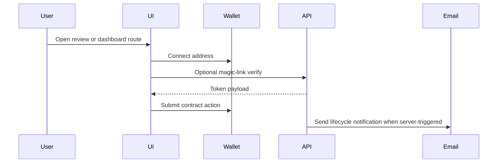
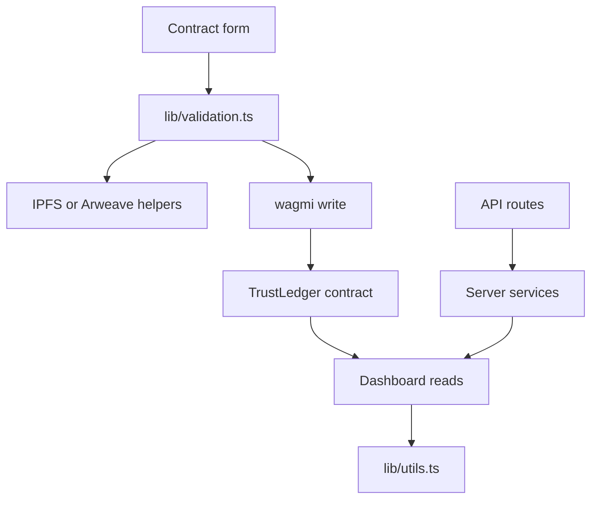

# TrustLedger Frontend And API

**Authors & Contributors:** [Kevin Le](https://www.linkedin.com/in/lekevin1),
[Kellen Snider](https://www.linkedin.com/in/kellen-snider-683396256/)

`src/` is the TrustLedger Next.js application. It contains the localized browser
UI, wallet wiring, API routes, server-side services, tests, public assets, and
frontend-specific developer tooling.

## Table Of Contents

- [Architecture](#architecture)
- [Directory Structure](#directory-structure)
- [Routing](#routing)
- [Frontend Architecture](#frontend-architecture)
- [Backend API Architecture](#backend-api-architecture)
- [State Management](#state-management)
- [Styling Architecture](#styling-architecture)
- [Authentication Flow](#authentication-flow)
- [Data Flow](#data-flow)
- [Performance](#performance)
- [Accessibility](#accessibility)
- [Testing](#testing)
- [Developer Workflow](#developer-workflow)
- [Related Documentation](#related-documentation)

## Architecture

```mermaid
flowchart LR
    Layout[app/[locale]/layout.tsx] --> Providers[Providers]
    Providers --> Theme[next-themes]
    Providers --> Wagmi[wagmi and Reown AppKit]
    Providers --> Query[React Query]
    Layout --> Navbar[Navbar]
    Layout --> Pages[Localized route pages]
    Pages --> Components[Route and shared components]
    Pages --> Lib[lib helpers]
    Pages --> API[app/api routes]
    API --> Services[services]
    Services --> Chain[viem public clients]
    Services --> Email[Resend]
    Services --> Oracle[Price provider]
```

## Directory Structure

```text
src/
├── app/
│   ├── [locale]/           Localized routes, layouts, and route-owned components
│   ├── api/                Admin, health, contract, magic-link, notification, oracle APIs
│   ├── globals.scss        Tailwind v4 load, theme tokens, global utilities
│   ├── helpers.css         Reusable surface, text, accessibility helper classes
│   └── app-desktop.scss    Desktop shell, page, and workspace layout rules
├── components/             Shared UI, navigation, theme, wallet, field controls
├── contexts/               Role and cross-cutting React context providers
├── hooks/                  Reusable client hooks for dispute and contract flows
├── i18n/                   next-intl routing, request config, navigation helpers
├── lib/                    ABI, chain config, storage, validation, crypto utilities
├── messages/               Localized JSON copy for supported locales
├── providers/              App-level client provider composition
├── services/               Server health, email, notification, oracle, admin modules
├── store/                  Client persistence for arbitration draft state
├── tests/
│   ├── e2e/                Playwright route, accessibility, overflow checks
│   ├── unit/               Jest unit tests and focused mocks
│   └── unit/__mocks__/     Strict browser/API shims for deterministic tests
├── types/                  Shared frontend TypeScript domain models
├── utils/                  Small frontend utility modules
├── public/                 Static images, icons, manifest, and public assets
├── .agents/                Frontend agent specialist guidance and skills
├── .claude/                Frontend Claude skills
└── skills/                 Reusable frontend development skills
```

<details>
<summary>App Router route map</summary>

```text
app/
├── [locale]/
│   ├── layout.tsx                       Locale shell, providers, navbar, footer.
│   ├── page.tsx                         Home page, animated escrow preview, CTAs.
│   ├── admin/                           Restricted read-only operator dashboard.
│   ├── legal/page.tsx                   Legal center backed by helpers/legal-docs.
│   ├── faq/page.tsx                     User-facing wallet, faucet, and recovery FAQ.
│   ├── dashboard/page.tsx               Contract cards, lifecycle actions, document tools.
│   ├── create/
│   │   ├── page.tsx                     Create route entry.
│   │   ├── _components/                 Form sections, upload, encryption, success view.
│   │   └── _lib/useCreatePageState.ts   Contract creation reducer and write orchestration.
│   ├── client/accept/                   Magic-link token verification and client approval.
│   ├── freelancer/review/               Freelancer review of client-proposed contracts.
│   ├── arbitration/[id]/                Evidence summaries, deadlines, voting status.
│   ├── juror/                           Stake, activate, inspect disputes, submit votes.
│   └── reputation/                      Address lookup and reputation history.
├── api/
│   ├── contract/[id]/route.ts           Public contract aggregation over viem reads.
│   ├── cron/deadline-reminders/route.ts Bounded deadline scanner for Vercel Cron.
│   ├── health/route.ts                  Admin-gated configuration health.
│   ├── health/runtime/route.ts          Public runtime probe for orchestration.
│   ├── magic-link/send/route.ts         Sends HMAC acceptance/review links.
│   ├── magic-link/verify/route.ts       Verifies HMAC token payloads and expiry.
│   ├── notifications/route.ts           Bearer-gated notification delivery.
│   └── oracle/                          Rates and provider freshness status.
├── globals.scss                         Theme tokens, motion, reduced-motion policy.
├── helpers.css                          Reusable utility classes and surface helpers.
└── proxy.ts                             Locale routing and security headers.
```

</details>

<details>
<summary>Shared module map</summary>

```text
components/
├── ConnectButton.tsx          Reown AppKit trigger, last-wallet hint, compact header mode.
├── Navbar.tsx                 Responsive nav, role switch, theme, contrast, wallet controls.
├── Footer.tsx                 Footer navigation, legal/security links, locale switcher.
├── FooterHelp.tsx             Guide/help affordance.
├── Field.tsx                  Accessible form field shell and shared field context.
├── Input.tsx / Select.tsx     Strict form controls built on Field context.
└── DecryptDocumentForm.tsx    Client-side encrypted document recovery UI.

helpers/
├── legal-docs.ts              Legal registry, locale support, translation prompt guardrails.
└── solana.ts                  Native Solana support mode, cluster config, address helpers.

lib/
├── abi.ts                     Contract ABIs and status labels.
├── wagmi.ts                   EVM chain, Reown AppKit, and explorer configuration.
├── validation.ts              URL, email, amount, score, and document validation.
├── encryption.ts              AES-GCM document encryption/decryption helpers.
├── magicLink.ts               HMAC token signing and verification.
├── lastWallet.ts              Safe last-connected-wallet label storage.
├── arweave.ts / ipfs.ts       Optional decentralized storage adapters.
└── utils.ts                   Formatting, time, amount, and URI utilities.

services/
├── adminAuth.ts                Admin credentials, sessions, IP, and wallet gating.
├── adminReport.ts              Sanitized read-only operator dashboard report.
├── email.ts                   Resend wrapper and HTML email shell.
├── notifications.ts           Lifecycle notification renderer and deadline scan logic.
├── oracle.ts                  Display exchange-rate fetch/cache/status service.
├── health.ts                  Runtime and configuration health report builder.
└── healthAuth.ts              Admin/IP authorization for health endpoints.
```

</details>

<details>
<summary>Testing and generated files map</summary>

```text
tests/
├── accessibility.spec.ts      Axe and route accessibility checks.
├── public-routes.spec.ts      Public route rendering and overflow checks.
├── unit/
│   ├── *.test.ts(x)           Helper, service, route, and component unit tests.
│   └── __mocks__/             Deterministic browser/API shims.
playwright.config.ts           Browser matrix and web-server config.
jest.config.ts                 next/jest integration, module aliases, jsdom.
jest.setup.ts                  Testing Library setup and app-level mocks.
eslint.config.mjs              Strict frontend ESLint flat config.
tsconfig.json                  Next.js TypeScript build config.
tsconfig.debug.json            Diagnostic TypeScript config for trace/debug runs.
knip.json                      Unused export/dependency audit config.
.swc/                          Locally seeded SWC binary cache, managed by tooling.
```

</details>

## Routing

All user-facing routes are locale-prefixed through `next-intl`.

| Route                         | Purpose                                     |
| ----------------------------- | ------------------------------------------- |
| `/[locale]`                   | Landing and workflow overview.              |
| `/[locale]/create`            | Contract creation and document upload flow. |
| `/[locale]/dashboard`         | Contract cards and lifecycle actions.       |
| `/[locale]/client/accept`     | Client magic-link review and acceptance.    |
| `/[locale]/freelancer/review` | Freelancer review for client-proposed work. |
| `/[locale]/arbitration/[id]`  | Dispute evidence and arbitration detail.    |
| `/[locale]/juror`             | Juror staking and voting workflows.         |
| `/[locale]/reputation`        | Reputation lookup and history.              |
| `/[locale]/faq`               | Recovery and support content.               |
| `/[locale]/legal`             | Legal document and compliance index.        |

## Frontend Architecture

- `Providers.tsx` wraps theme, role, wagmi, React Query, AppKit theme sync, and
  inactivity logout.
- `Navbar.tsx` owns top-level navigation, role switching, source link, contrast
  toggle, theme toggle, and wallet control.
- Route-specific components live beside their route, for example
  `app/[locale]/create/_components`.
- Shared primitives such as `Field`, `Input`, `Select`, and `ConnectButton` live
  in `components/`.
- Chain data, ABI constants, address resolution, and network helpers live in
  `lib/`.

## Backend API Architecture

| Route                         | Service                                 | Notes                                           |
| ----------------------------- | --------------------------------------- | ----------------------------------------------- |
| `api/admin/session`           | `services/adminAuth.ts`                 | Creates or clears signed admin sessions.        |
| `api/admin/summary`           | `services/adminReport.ts`               | Admin-gated read-only operator report.          |
| `api/health/runtime`          | `services/health.ts`                    | Public runtime probe for containers.            |
| `api/health`                  | `services/health.ts`                    | Admin-gated config presence and URL validity.   |
| `api/contract/[id]`           | viem read in route                      | Returns JSON-safe contract aggregation.         |
| `api/magic-link/send`         | `lib/magicLink.ts`, `services/email.ts` | Sends wallet-bound HMAC link.                   |
| `api/magic-link/verify`       | `lib/magicLink.ts`                      | Verifies token signature and expiry.            |
| `api/notifications`           | `services/notifications.ts`             | Bearer-gated lifecycle email route.             |
| `api/cron/deadline-reminders` | `services/notifications.ts`             | Bearer-gated bounded deadline scanner.          |
| `api/oracle/rates`            | `services/oracle.ts`                    | Validated display exchange rates.               |
| `api/oracle/status`           | `services/oracle.ts`                    | Supported pairs, provider, TTL, cache metadata. |

## State Management

| State             | Owner                                            |
| ----------------- | ------------------------------------------------ |
| Wallet connection | wagmi and Reown AppKit                           |
| Query caching     | React Query                                      |
| Theme             | `next-themes` with class strategy                |
| High contrast     | `ContrastToggle` and `html.high-contrast`        |
| Role              | `contexts/RoleContext.tsx`                       |
| Create form       | `app/[locale]/create/_lib/useCreatePageState.ts` |
| Wallet hint       | `lib/lastWallet.ts`                              |

Keep new state local unless it crosses a provider or route boundary.

## Legal And Security References

Frontend changes that affect wallet flows, arbitration, dispute copy, privacy,
risk, or policy language should use `.sixth/skills/legal-compliance/SKILL.md`
and check [Legal And Compliance](../docs/LEGAL.md), [Security](../SECURITY.md),
and [Security Docs](../docs/SECURITY.md).

## Styling Architecture

The app uses Tailwind CSS v4 through `app/globals.scss` and
`postcss.config.mjs`.

| File                   | Role                                                                                |
| ---------------------- | ----------------------------------------------------------------------------------- |
| `app/globals.scss`     | Tailwind load, theme variant, keyframes, global utilities, reduced-motion policy.   |
| `app/helpers.css`      | Reusable surface, text, link, accessibility, responsive, and high-contrast helpers. |
| `app/app-desktop.scss` | Shell widths, page headers, workspace grids, and responsive layouts.                |
| `.swc/config.json`     | Explicit frontend SWC parser, target, module, and React transform policy.           |

Design rules:

- Use restrained indigo for primary actions and active state.
- Use semantic surface helpers before adding new one-off colors.
- Do not use decorative motion, gradient text, or glass cards.
- Keep body text readable in light and dark modes.
- Use `tl-link-underline` for refined text-link hover and active states.

## Authentication Flow



Wallet ownership is the primary authorization signal for contract actions.
Bearer secrets protect server-only email and cron routes.

## Data Flow



## Performance

- Keep wallet reads scoped to the route that needs them.
- Use bounded RPC reads and chunk event scans.
- Prefer server routes for heavy aggregation.
- Keep static UI assets small. The navbar mark uses `trustledger-mark.svg`.
- Animate state feedback only and honor `prefers-reduced-motion`.
- Run React Doctor after component changes.

## Accessibility

- Use semantic landmarks from the root layout.
- Keep the skip link available before navigation.
- Every icon button needs an `aria-label` or equivalent accessible name.
- Form fields use visible labels and inline errors.
- State badges include text labels and non-color indicators.
- Theme, contrast, and focus states must work in light and dark modes.
- Playwright checks public routes for horizontal overflow.

## Testing

| Type          | Command                        |
| ------------- | ------------------------------ |
| Typecheck     | `npx tsc --noEmit`             |
| Frontend lint | `npm run lint:frontend`        |
| Style lint    | `cd .. && npm run lint:styles` |
| Knip audit    | `cd .. && npm run lint:knip`   |
| Unit tests    | `npm run test:unit`            |
| Coverage      | `npm run test:coverage`        |
| E2E           | `npm run test:e2e`             |
| React Doctor  | `npm run doctor`               |
| Build         | `npm run build:frontend`       |

## Developer Workflow

Run commands from `src/` unless the command is documented as root-level.

```bash
npm install
npm run dev:frontend
npx tsc --noEmit
npm run lint:frontend
npm run test:unit
npm run build:frontend
```

After local contract deployment, run the root command:

```bash
npm run sync:frontend:env
```

That writes frontend contract addresses into `src/.env.local`.

## Related Documentation

- [Root README](../README.md)
- [Frontend Guide](../docs/FRONTEND.md)
- [Analytics And Native Kernels](../docs/ANALYTICS.md)
- [Oracle Architecture](../docs/ORACLE.md)
- [Solana Support](../docs/SOLANA.md)
- [Utilities](../docs/UTILITIES.md)
- [Type Stubs](../docs/STUBS.md)
- [Environment](../docs/ENVIRONMENT.md)
- [Testing](../docs/TESTING.md)
